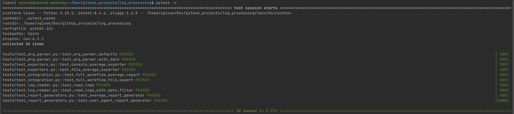
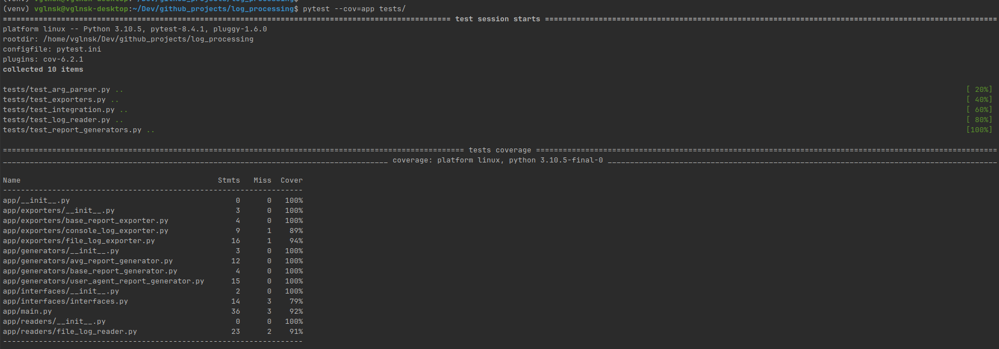
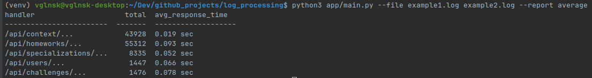
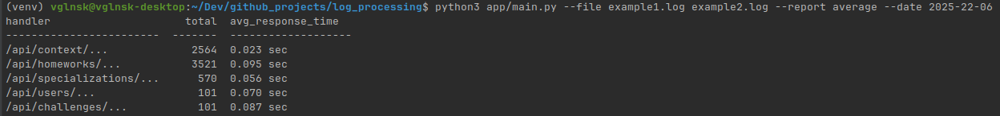
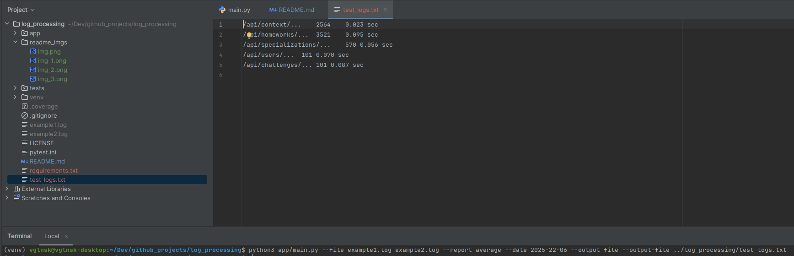

# Log processing

## Из корня приложения ../log_processing/

### установите виртуальное окружение и активируйте его
```bazaar
python -m venv venv
source venv/bin/activate # Linux
```

### установите зависимости
```bazaar
python -m pip install -r requirements.txt
```

### запустить тесты
```bazaar
pytest -v
```


### проверить процент покрытия тестами
```bazaar
pytest --cov=app tests/
```


### запустить скрипт без даты
```bazaar
python3 app/main.py --file path/to/log1.log path/to/log2.log --report average
```


### запустить скрипт с датой
```bazaar
python3 app/main.py --file path/to/log1.log path/to/log2.log --report average --date 2025-22-06
```


### ### запустить скрипт с записью в файл
```bazaar
python3 app/main.py --file path/to/log1.log path/to/log2.log --report average --date 2025-22-06 --output file --output-file path_to_file
```

